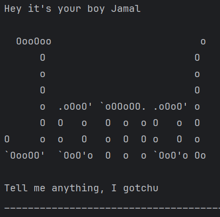

# Jamal User Guide

# 1. Introduction

Jamal is a task management chatbot that allows you to manage your to-dos, deadlines, and events in a conversational style. It stores your tasks and helps keep track of what needs to be done.



## Key Features

- ✅ **Add, delete, and list tasks**
- ✅ **Mark tasks as done or undone**
- ✅ **Store tasks with deadlines**
- ✅ **Save and load tasks from a file**

# 2. Quick Start

## Setting Up

### Step 1: Download the JAR file
Go to the **[GitHub Releases](https://github.com/Jensenkuok/ip/releases)** page and **download the latest JAR file**.

### Step 2: Ensure Java 17 is Installed
Run the following command in your terminal to check your Java version:

```bash
java -version
```

### Step 3: Run the Chatbot
Navigate to the folder where you downloaded the JAR file and run:

```bash
java -jar jamal.jar
```

Once started, **Jamal** will greet you and wait for your commands! 🎉

# 3. Features

## 3.1 Adding a ToDo

**Format:**
```bash
todo TASK_DESCRIPTION
```

**Example:**
```bash
todo Read a book
```

**Expected Output:**
```plaintext
Got it! One more task for you:
  [T][ ] Read a book
Now you have 1 task in the list.
```

## 3.2 Adding a Deadline

**Format:**
```bash
deadline TASK_DESCRIPTION /by DATE_TIME
```

**Example:**
```bash
deadline Submit report /by 2/12/2019 1800
```

**Expected Output:**
```plaintext
Got it! One more task for you:
  [D][ ] Submit report (by: Dec 02 2019, 6:00PM)
Now you have 2 tasks in the list.
```

✅ **Date Format:** `dd/MM/yyyy HHmm`  
✅ **Displays as:** `MMM dd yyyy, h:mm`

## 3.3 Adding an Event

**Format:**
```bash
event TASK_DESCRIPTION /from START_TIME /to END_TIME
```

**Example:**
```bash
event Team meeting /from 3/12/2019 1400 /to 3/12/2019 1600
```

**Expected Output:**
```plaintext
Got it! One more task for you:
  [E][ ] Team meeting (from: 3/12/2019 1400 to 3/12/2019 1600)
Now you have 3 tasks in the list.
```

## 3.4 Listing All Tasks

**Format:**
```bash
list
```

**Example Output:**
```plaintext
You got a lot to do boy:
1.[T][ ] Read a book
2.[D][ ] Submit report (by: Dec 02 2019, 6:00PM)
3.[E][ ] Team meeting (from: 3/12/2019 1400 to: 3/12/2019 1600)
```

## 3.5 Marking a Task as Done

**Format:**
```bash
mark TASK_NUMBER
```

**Example:**
```bash
mark 1
```

**Expected Output:**
```plaintext
Lesgooo I've marked this task as done:
  [T][X] Read a book
```

## 3.6 Unmarking a Task

**Format:**
```bash
unmark TASK_NUMBER
```

**Example:**
```bash
unmark 1
```

**Expected Output:**
```plaintext
Damn, I thought you finished it already, guess not:
  [T][ ] Read a book
```

## 3.7 Deleting a Task

**Format:**
```bash
delete TASK_NUMBER
```

**Example:**
```bash
delete 2
```

**Expected Output:**
```plaintext
Noted. I've removed this task:
  [D][ ] Submit report (by: Dec 02 2019, 6:00PM)
Now you have 2 tasks in the list.
```

## 3.8 Finding Tasks

**Format:**
```bash
find KEYWORD
```

**Example:**
```bash
find book
```

**Expected Output:**
```plaintext
Here are the matching tasks in your list:
1.[T][ ] Read a book
```

## 3.9 Exiting the Chatbot

**Format:**
```bash
bye
```

**Expected Output:**
```plaintext
Aight, take care! Catch you later.
```

# 4. Notes on Command Format

- ✅ **Lower cae format:** `todo`, `deadline`, and `mark` are valid commands.
- ✅ **Case Sensitive:** `TODO`, `DEADLINE`, and `MARK` are invalid commands.
- ✅ **Parameters must be in order:** `deadline /by 2/12/2019 1800 submit report` is **invalid**, the correct order must be followed.
- ✅ **Do not enter extra parameters:** `list 123` is invalid.
- ✅ **Date & Time Format for Dealine Tasks:** `dd/MM/yyyy HHmm` (e.g., `2/12/2019 1800` → `Dec 02 2019, 6:00PM`).
- ✅ **Note:** `delete`, `mark`, `unmark` works only on the full list of tasks.

# 5. Saving and Loading Tasks

- ✅ **Tasks are saved automatically** after every `add`, `delete`, `mark`, or `unmark` command.
- **File Location:** `data/jamal.txt`
- **Example Format in `jamal.txt`:**

```plaintext
T | 0 | Read a book
D | 1 | Submit report | Dec 02 2019, 6:00PM
E | 0 | Team meeting | 3/12/2019 1400 to 3/12/2019 1600
```

# 6. Summary of Commands

| Command            | Format                                  | Example                                       |
|--------------------|----------------------------------------|-----------------------------------------------|
| **Add ToDo**      | `todo TASK`                            | `todo Buy milk`                              |
| **Add Deadline**  | `deadline TASK /by DATE_TIME`         | `deadline CS2103T Assignment /by 20/03/2025 2359` |
| **Add Event**     | `event TASK /from START_TIME /to END_TIME` | `event Meeting /from 15/04/2025 0900 /to 1100` |
| **List Tasks**    | `list`                                 | `list`                                       |
| **Mark Task as Done** | `mark TASK_NUMBER`               | `mark 2`                                     |
| **Unmark Task**   | `unmark TASK_NUMBER`                   | `unmark 2`                                   |
| **Delete Task**   | `delete TASK_NUMBER`                   | `delete 3`                                   |
| **Find Task**     | `find KEYWORD`                         | `find CS2103T`                               |
| **Exit Chatbot**  | `bye`                                  | `bye`                                        |

# 7. Credits

Jamal Chatbot is developed by Jensenkuok as part of an NUS CS2113 software engineering project.  